## 神经元之间

- 暂时没分析出特点，还在做😭

## 层与层之间

- 选择`epoch20`时的冲突值进行分析

- 对`conditioner_0~conditioner_9`中除`bias`外的所有神经元冲突值进行统计，绘制箱线图，每一层的神经元冲突值都呈现明显的右偏态分布，数据偏向较大的一侧

  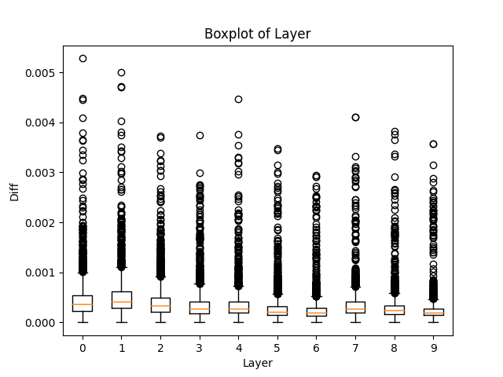

- 不显示上图中异常值的箱线图：`conditioner_0~conditioner_2`的数据在四分位范围内的离散程度较其他层更大，并且它们的中位数与平均值也相对较大

  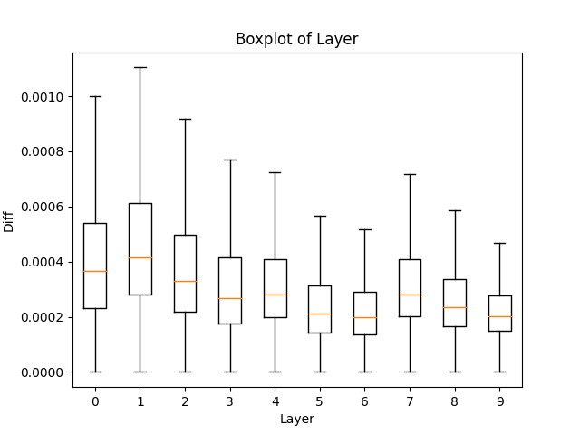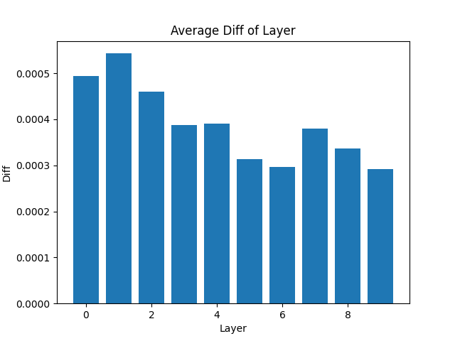

- 对`condationer_0`中不同层的神经元冲突值进行分析，`layers_0`和`layers_4`冲突值均值较大并且离散程度更高，而`layers_1`和`layers_2`冲突值较为集中且数值较小，并且这种现象在`conditioner_0~conditioner_9`中都出现了。这也表明第一个箱线图中每层的异常值都来源于`layers_0`和`layers_4`

  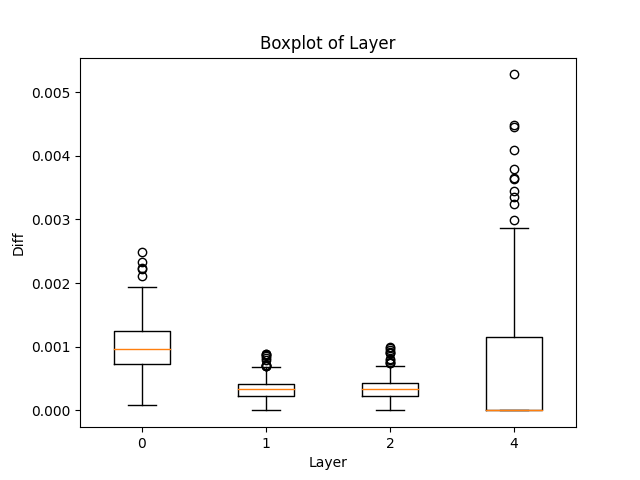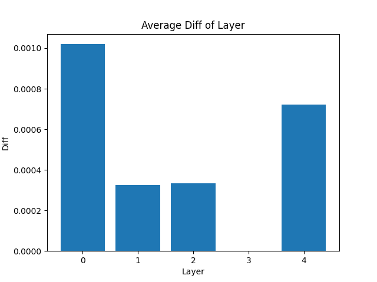

- 对`scalar`层中`scales`的冲突值进行分析，也呈现出两头离散程度与均值大，中间离散程度与均值小的规律

  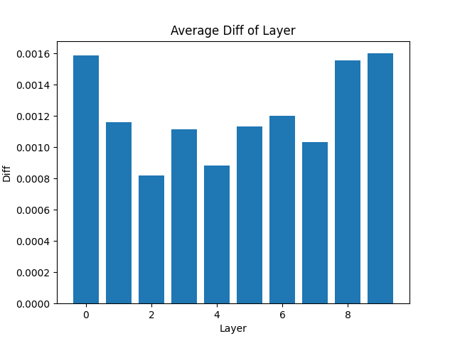

- `scalar`层中`shifts`的冲突值

  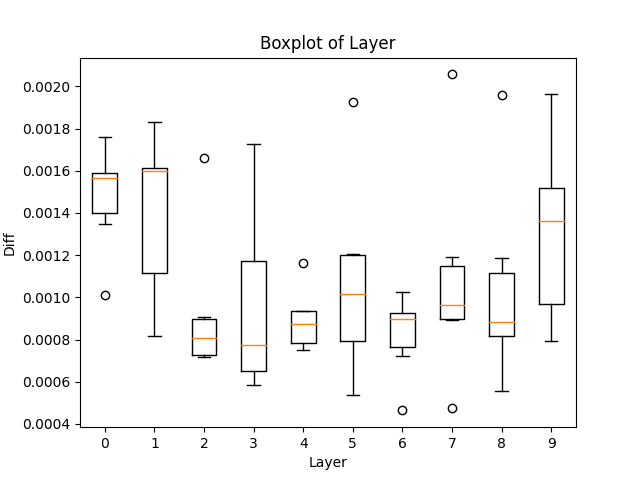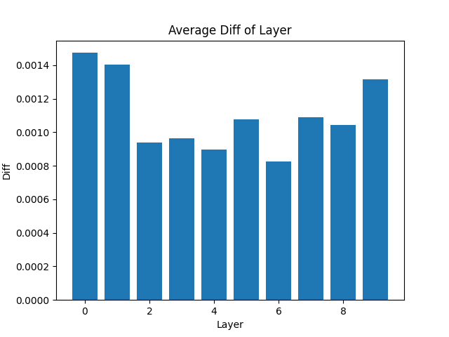

## 随训练过程，冲突的变化

- 随时间变化，对`conditioner_0~conditioner_9`中除`bias`外的所有神经元进行冲突值统计，其均值有上升的趋势，而方差较为平缓，其中`conditioner_4`和`conditioner_5`在`epoch21`有激增

  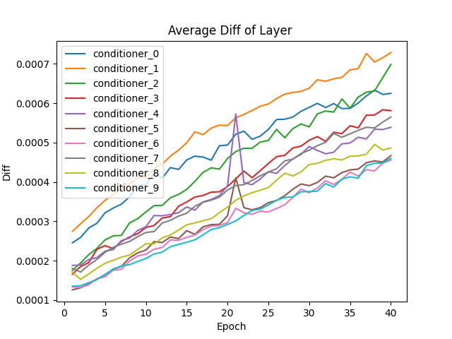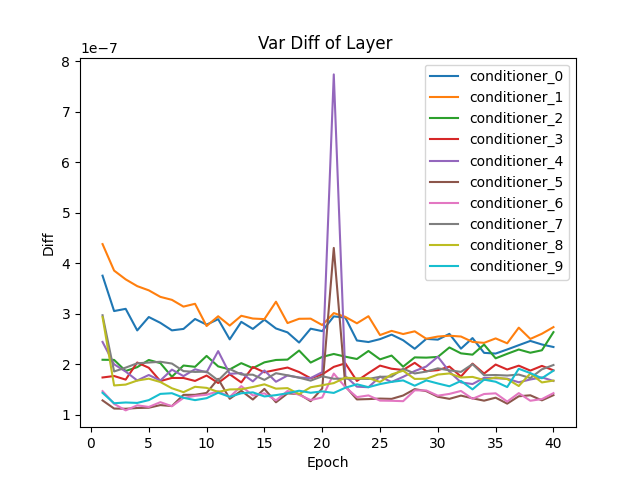

- `conditioner_0`中不同层的神经元冲突值平均值随训练过程变化曲线，随训练过程，`layers_0,layers_1,layers_2`冲突值平均值有上升的趋势，而`layers_4`有下降的趋势，但总体上还是存在两头的冲突值大于中间冲突值的现象。对于`layers_4`，处于后面的`conditioner`的这种下降趋势越来越小，最后在`conditioner_9`中`layers_4`也表现为上升趋势

  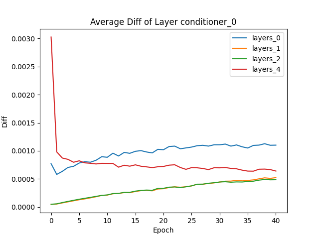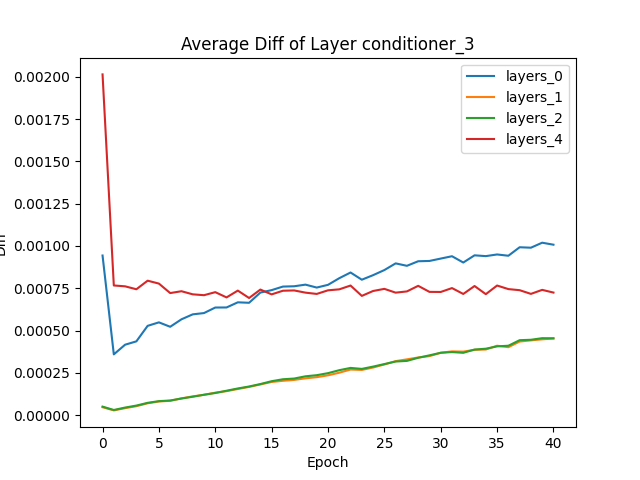

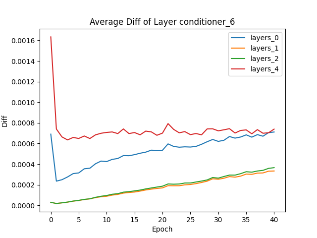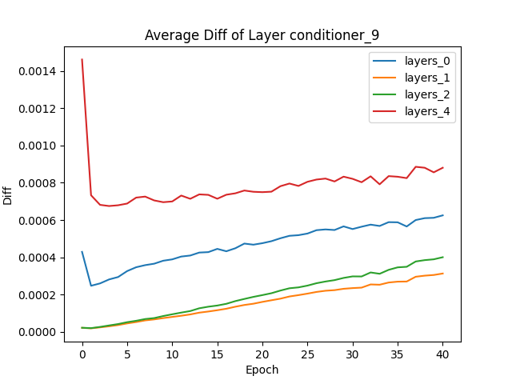  

​      方差随时间变化，其它`conditioner`层方差曲线与下图类似，由于`layers_4`方差较其他层过大，去掉`layers_4`再画一张图，可以看到随着训练过程，冲突值的方差有上升趋势

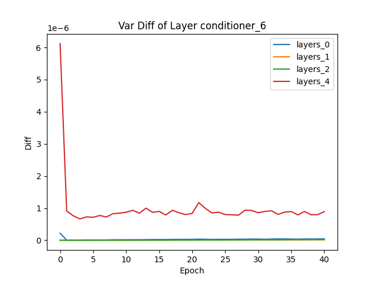

- `scalar`层中`scales`和`shifts`冲突值的平均值随训练过程的变化曲线，每层的冲突值都在波动，除了从`epoch0`到`epoch1`有下降外，没有明显的变化趋势，方差也是如此

  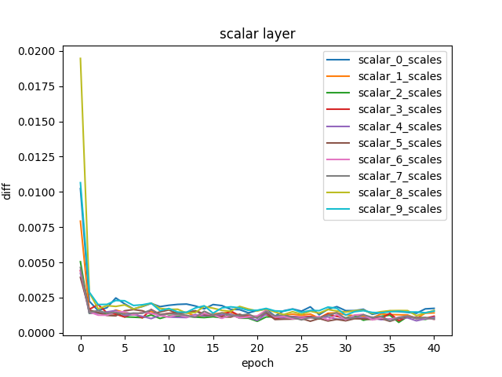